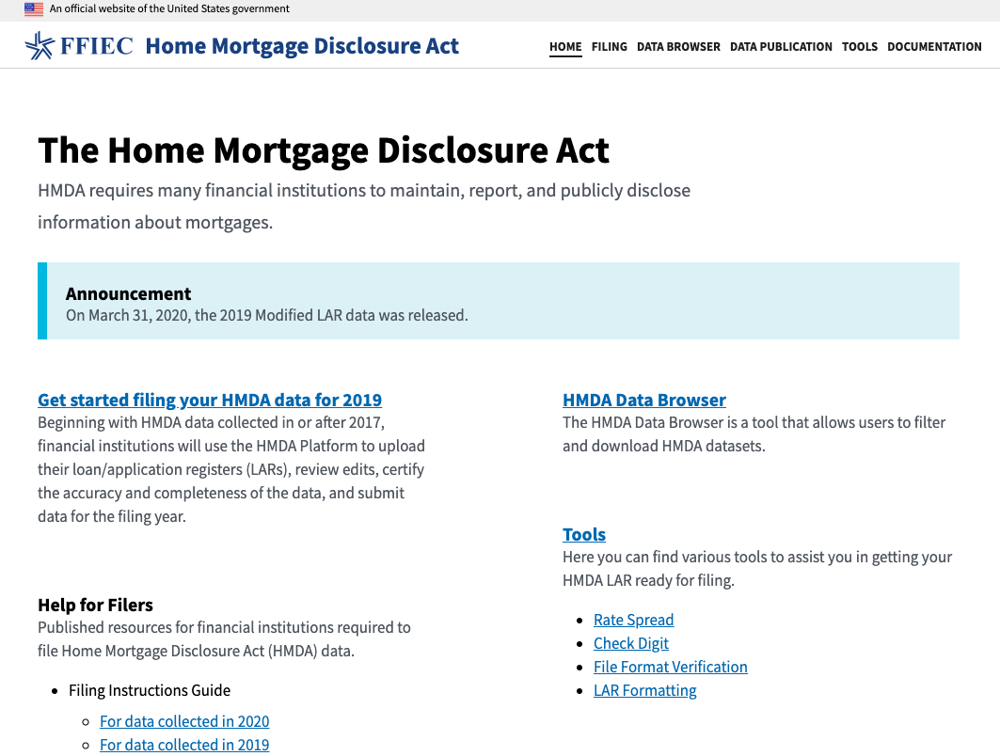
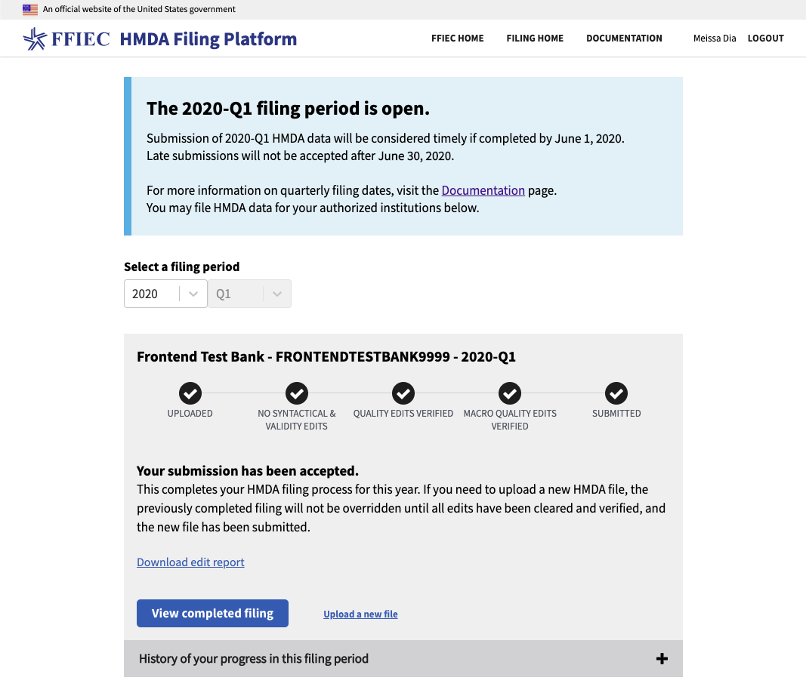
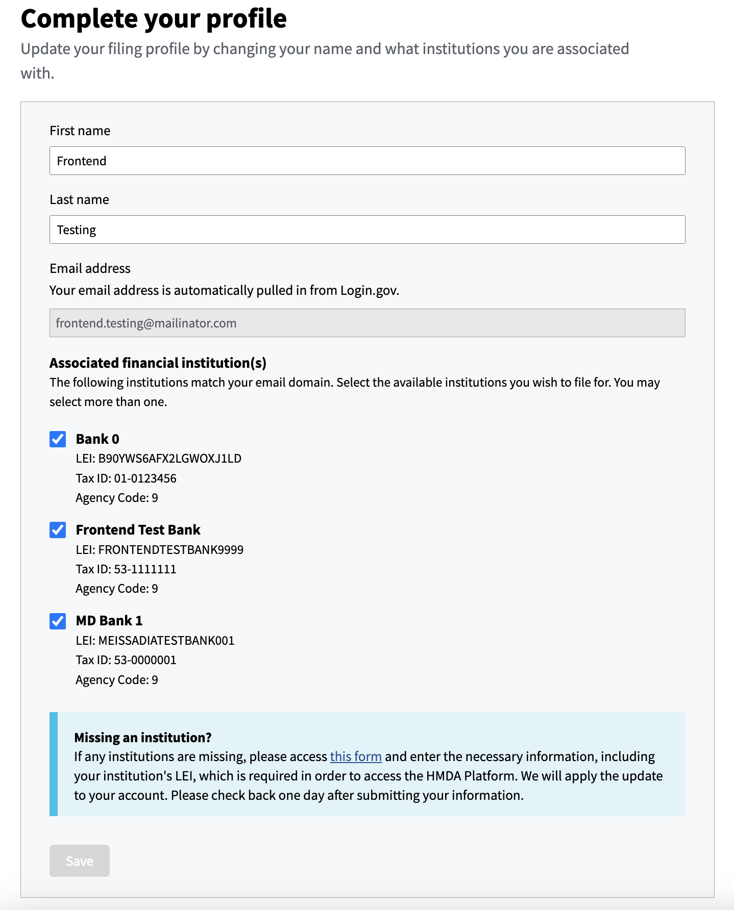
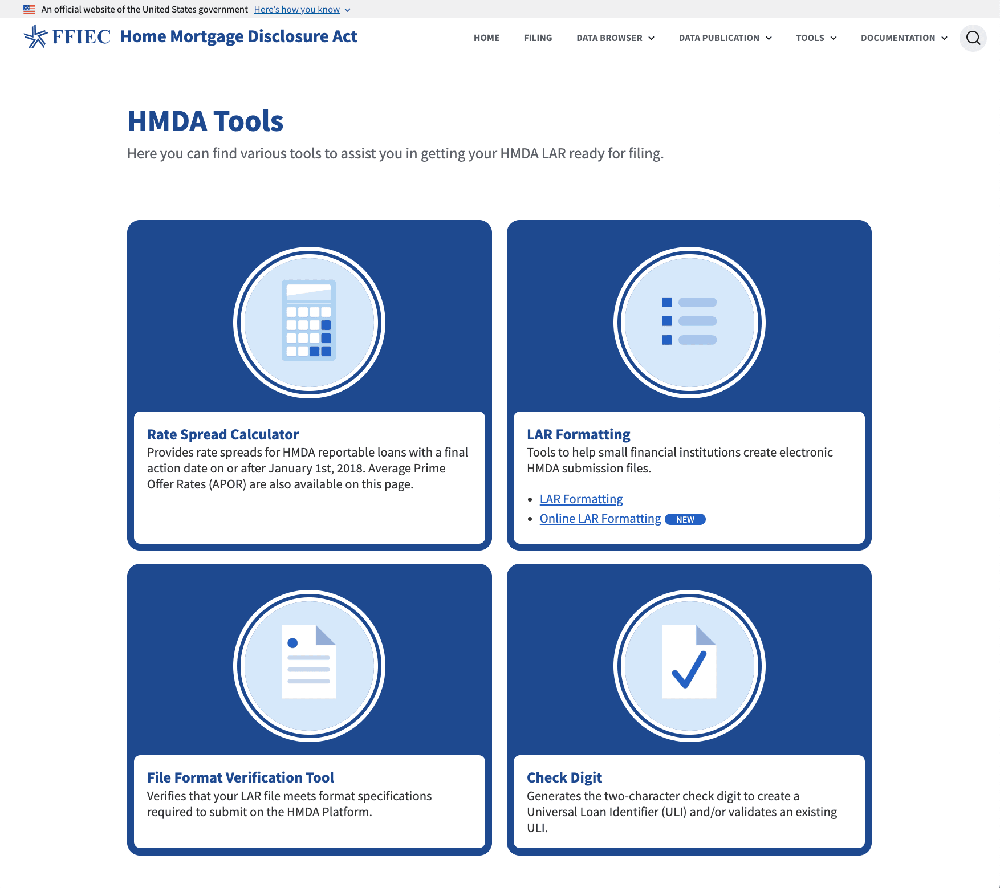
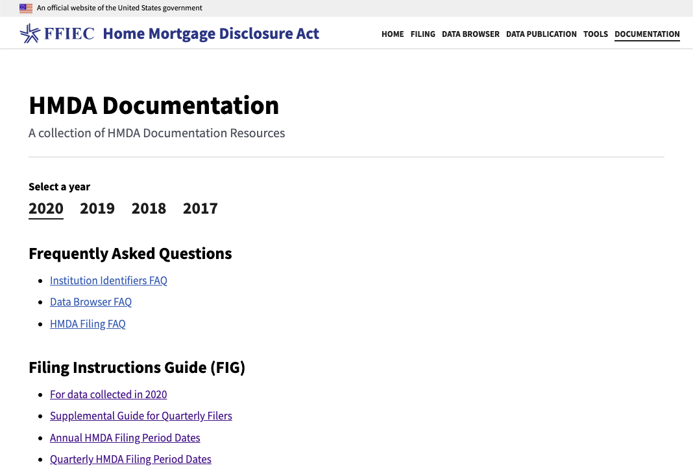
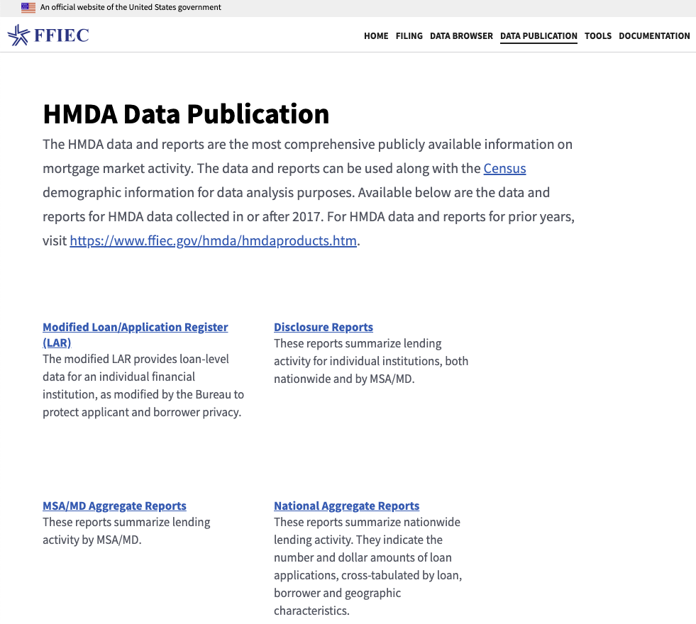
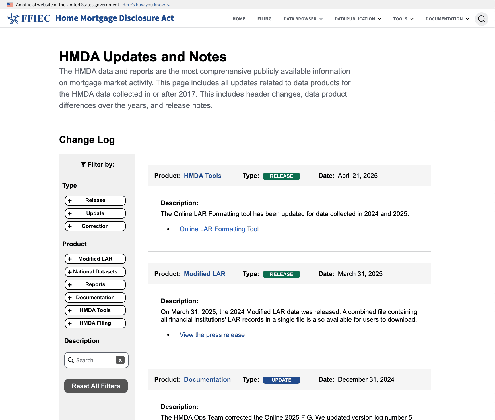
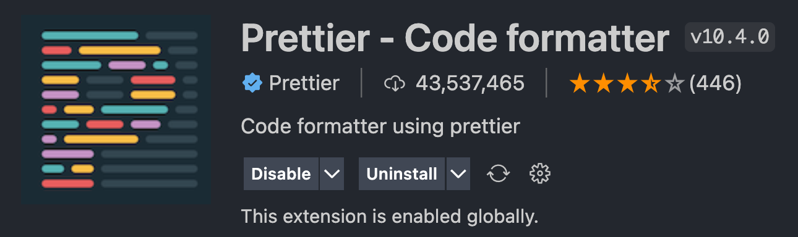
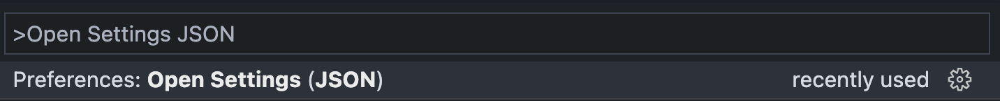

# HMDA Frontend Projects


The HMDA Frontend monorepo hosts the public facing applications for the collection, publication, and navigation of millions of HMDA records per year. This repository combines six, previously separate, React application repos in order to simplify component sharing, synchronize versioning of common dependencies, and improve rendering efficiency when navigating between apps.

## Contents

- [HMDA Frontend Projects](#hmda-frontend-projects)
  - [Contents](#contents)
  - [Technical Overview](#technical-overview)
  - [Applications](#applications)
    - [HMDA Homepage](#hmda-homepage)
    - [HMDA Filing](#hmda-filing)
      - [HMDA User Profile](#hmda-user-profile)
    - [HMDA Data Browser](#hmda-data-browser)
    - [HMDA Platform Tools](#hmda-platform-tools)
    - [HMDA Documentation](#hmda-documentation)
    - [HMDA Data Publication](#hmda-data-publication)
    - [HMDA Data Publication - Updates and Notes](#hmda-data-publication---updates-and-notes)
  - [Development](#development)
    - [Requirements](#requirements)
    - [Installation](#installation)
    - [Running Locally](#running-locally)
      - [Integrating with the Filing application](#integrating-with-the-filing-application)
        - [Create Institutions](#create-institutions)
        - [Bypass API Authentication](#bypass-api-authentication)
        - [Configure the UI](#configure-the-ui)
      - [Updating or Previewing Documentation](#updating-or-previewing-documentation)
    * [Running via Docker](#running-via-docker)
    * [Code Formatting](#code-formatting)
  - [Creating and editing Markdown](https://github.com/cfpb/hmda-frontend/wiki/Creating-and-updating-Markdown-files)
  - [Adding GIFs](#adding-gifs)
  * [Testing](#testing)
    - [Unit Tests](#unit-tests)
    - [End-to-End Testing](#end-to-end-testing)
    - [Running in TravisCI](#running-in-travisci)

## Technical Overview

Each React application lives in it's own sub-directory of the `/src` folder, with shared assets and components housed in `/common`. All sub-applications are rendered as asynchronous components within an application shell `/App.jsx` that provides a common header. This approach eliminates unneccesary reloading of the site-wide navigation, giving the separate apps a more connected feel. [React Router](https://reacttraining.com/react-router/) is used for client side routing with [React Redux](https://redux.js.org/) integrated for state management of the more complex apps, such as Filing. [Unit tests](#unit-tests) are developed using Enzyme and [end-to-end](#end-to-end-testing) testing performed with Cypress. Dependencies are managed with [yarn](https://yarnpkg.com/getting-started).

## Applications

### HMDA Homepage

[HMDA Homepage](https://ffiec.cfpb.gov/) is a single-page app providing easy access to the HMDA applications, tools, data products, and documentation.

<a href='./readme-files/hmda-homepage.png' alt='HMDA Homepage'>
  <p align='center'>
    
  </p>
</a>

### HMDA Filing

The [HMDA Filing Platform UI](https://ffiec.cfpb.gov/filing/) allows lending institutions to submit HMDA records, resolve errors, verify edits, review submission status and history, and sign submissions.

<a href='./readme-files/hmda-filing.png' alt='HMDA Filing Overview'>
  <p align='center'>
    
  </p>
</a>

#### HMDA User Profile

The [HMDA Profile page](https://ffiec.cfpb.gov/filing/profile) is designed to update associated institutions with the logged in account. Once the associated institutions have been added to your account, you can now file for those institutions.

<a href='./readme-files/hmda-completeprofile.png' alt='HMDA User Profile Information'>
  <p align='center'>
    
  </p>
</a>

### HMDA Data Browser

The [HMDA Data Browser](https://ffiec.cfpb.gov/data-browser/) enables users to easily filter and download aggregated HMDA datasets.

<a href='./readme-files/hmda-data-browser.gif' alt='HMDA Data Browser'>
  <p align='center'>
    
  </p>
</a>

### HMDA Platform Tools

The [HMDA Platform Tools](https://ffiec.cfpb.gov/tools/) assist filers in the preparation of submission data, including calculation of Rate Spread, generation and validation of Check Digits, as well as submission file generation and format verification.

<a href='./readme-files/hmda-tools.png' alt='HMDA Platform Tools'>
  <p align='center'>
    
  </p>
</a>

### HMDA Documentation

The [HMDA Documentation](https://ffiec.cfpb.gov/documentation/) site provides product FAQs, detailed Filing instructions, data publication schema and usage guides, as well as direction for using the HMDA Tools. Documentation content is hosted as easily editable Markdown files, loaded using Docusaurus. This allows updates to be pushed to Production without a project redeployment. Docusarus search is powered by [Algolia](https://www.algolia.com/) through the [DocSearch](https://docsearch.algolia.com/) program.

<a href='./readme-files/hmda-documentation.png' alt='HMDA Documentation'>
  <p align='center'>
    
  </p>
</a>

### HMDA Data Publication

[HMDA Data Publication](https://ffiec.cfpb.gov/data-publication/) provides datasets and reports of HMDA data collected in or after 2017 which, combined with [Census](https://www.ffiec.gov/censusproducts.htm) demographic data, can be used for data analysis purposes.

<a href='./readme-files/hmda-data-publication.png' alt='HMDA Data Publication'>
  <p align='center'>
    
  </p>
</a>

### HMDA Data Publication - Updates and Notes

[Publication Updates and Notes](https://ffiec.cfpb.gov/data-publication/updates) provides a searchable change log of updates, releases, and corrections to published HMDA Data. Visit the [Updates and Notes FAQ](./src/data-publication/ChangeLog/README.md) for details.

<a href='./readme-files/hmda-data-publication-updates.png' alt='HMDA Data Publication'>
  <p align='center'>
    
  </p>
</a>

## Development

### Requirements

- Node >= v20.8.0
- Yarn berry >= v4.0.2

### Installation

- Clone repo
- Run `yarn` from repo root to install depencencies

### Running Locally

Several components of the Frontend (ex. Filing, Data Browser) require a connection to the [HMDA Platform](https://github.com/cfpb/hmda-platform) in order to operate. You can find instructions for the running the HMDA Platform locally [here](https://github.com/cfpb/hmda-platform#running-with-sbt).

HMDA Help requires a connection to the [HMDA Institutions API](https://github.com/cfpb/hmda-platform/tree/master/institutions-api) in order to operate. You can find instructions for the running the HMDA Institutions API locally [in the README](https://github.com/cfpb/hmda-platform/blob/master/institutions-api/README.md). Note that having the HMDA Platform running is a pre-requisite to starting the HDMA Institutions API.

If your development does not require this integration, `yarn start` will run the development server, opening a browser window to http://localhost:3000.

#### Integrating with the Filing application

By default, the locally running [Frontend is configured to use the Filing API](https://github.com/cfpb/hmda-frontend/blob/master/package.json#L65) from the locally running Platform. In order to go through the Filing process, there are a few elements that need to be completed first:

- Create Institutions (Platform)
- Bypass API authentication (Platform)
- Configure the UI (Frontend)

##### Create Institutions

Before you can submit a Filing you need to have an Institution created on the Platform for each year you want to test. The following command will generate the required data for the default test Institution, for all currently available filing periods. You need to have the HMDA Platform started before running this command:

```
yarn ci-data
```

To create data for an Institution other than the default `FRONTENDTESTBANK9999`, you can modify `cypress/ci/config/institutions.json` and rerun the above command.

This Institution loading needs to be done each time the HMDA Platform is restarted.

##### Bypass API Authentication

On the Platform, you will need to set an environment variable to prevent the API from requiring an authentication token for incoming requests. If already running, you will need to restart the Platform.

```
export HMDA_RUNTIME_MODE=dev
```

##### Configure the UI

If you will be testing against an Institution that is not the default, you can configure this via a `VITE_*` variable:

```
VITE_LEIS=INSTITUTION1,INSTITUTION2
```

Second, you will need to bypass Frontend authentication. This is most easily done by running the Frontend the way we do in a Continuous Integration environment:

```
yarn ci
```

To combine these configuration options

```
VITE_LEIS=INSTITUTION1,INSTITUTION2 yarn ci
```

You can now visit the filing application at http://localhost:3000/filing.

### Running via Docker

To see the application running in a container you can run:

```
docker build -t hmda/hmda-frontend .
docker run -p 8080:8080 hmda/hmda-frontend
```

To build using docker-compose:

```
docker-compose build
```

### Code Formatting

The prettier formatting tool the formatter of choice for this repo.

Prettier Format API: https://prettier.io/docs/en/options.html

The `.prettierrc.json` file contains the specific formatting for each file. <br />
The `.prettierignore` file will ignore formatting any directories or files listed.

In order to have `Prettier` properly format the developers code there are a few steps that developer needs to take.

1. Install the `Prettier` code extension

<a href='./readme-files/prettier-extension.png' alt='Prettier Extension Install'>
  <p align='center'>
    
  </p>
</a>

2. Update the developers Visual Studio Code user settings to use the `Prettier` formatter as the default formatter

First open your `settings.json` file by clicking `View` at the top of VS Code then click `Command Palette` and then type what is in the screenshot below.

<a href='./readme-files/navigate-settings-json-file.png' alt='Navigate to Settings JSON File'>
  <p align='center'>
    
  </p>
</a>

Now we need to add 2 lines of code to our JSON file.

```JSON
"editor.defaultFormatter": "esbenp.prettier-vscode",
"editor.formatOnSave": true,
```

The newly added lines tell VS Code to use `Prettier` as the default formatter and will format the code when the file is saved.

### Helpful Prettier formatting scripts

#### Running all files:

```
npx prettier --write
```

#### Directory Specific:

```
npx prettier --write {enter-directory}
```

#### Check files formatting:

```
npx prettier --check
```

The above command will return in the terminal what files have not been formatted by prettier.

#### NOTE: formatting settings that prettier cannot do:

- Format on Paste
  - `"editor.formatOnPaste": true,`
- Themes
- Icon Themes

## Adding GIFs

Why GIFs? GIFs provide a better visual repesentation of how a parituclar part of the UI functions.

Examples that are already in our README

- [HMDA Data Browser](#hmda-data-browser)
- [End to End Testing](#end-to-end-testing)

### Record video to turn into GIF

Navigate to [Apple support native screenshot & recording controls](https://support.apple.com/guide/mac-help/take-a-screenshot-mh26782/mac) to learn how to use MacOS controls.

**Create recording bounds** <br>
On your Mac, press Shift-Command-5 (or use Launchpad) to open Screenshot and display the tools. Drag the bounds to be where it needs to be for recording the video.

Navigate to [Apple support how to record with QuickTime Player](https://support.apple.com/en-us/102618).

### Convert video file to `.gif`

Small file size + lower quality [video to gif converter](https://biteable.com/tools/video-to-gif/). <br>
Large file size + higher quality [video to gif converter](https://cloudconvert.com/mov-to-gif).

### Store the GIF in the Frontend

Navigate to the `readme-files` directory and upload the `.gif` extension this directory.

### How to use GIF in README

Paste the below code to the section you want to import your GIF and update the `name-of-gif` pieces.

```HTML
<a href='./readme-files/name-of-gif.gif' alt='name-of-alt'>
  <p align='center'>
    
  </p>
</a>
```

## Testing

### Unit Tests

```
yarn test
```

[Enzyme](https://enzymejs.github.io/enzyme/) enables isolated testing of React components. Unit tests providing verification of feature implementation while also serving as suite of regression tests.

### End-to-End Testing

```
yarn run cypress run
```

[Cypress](https://www.cypress.io/) is used to perform end-to-end testing of the filing application, tools, data publication products, and data browser. It mimicks a user's interaction with the site and allows for rapid, automated system validation of project deployments.


