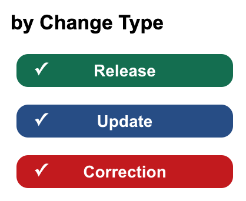

# FAQ

## Do updates require redeployment?
No, just a PR. We fetch [change-log-data.json]('https://raw.githubusercontent.com/cfpb/hmda-frontend/master/src/data-publication/ChangeLog/change-log-data.json') from Github.

## How do I create a new entries?

### Example entry
```
{
  "date": "03/10/21",
  "type": "release | update | correction",
  "product": "mlar | datasets | reports | documentation | tools",
  "description": "This example has been created!",
  "url": "https://github.com/cfpb/hmda-frontend/issues/1"
},
```  

### Date
Date the change will go live. Displayed entries are sorted by this date.

### Description
A description of the change.

### Type
- `release` - Newly released product or feature  
- `update` - Update to existing product not related to an error  
- `correction` - Modification to existing data to correct an error   

  

### Product
- `mlar` - Modified LAR  
- `datasets` - Snapshot/Dynamic Datasets  
- `reports` - Disclosure/Aggregate Reports  
- `documentation` - Documentation pages  
- `tools` - Rate Spread/Check Digit/LARFT/FFVT 

### URL
Not currently used but could provide a link to additional info.