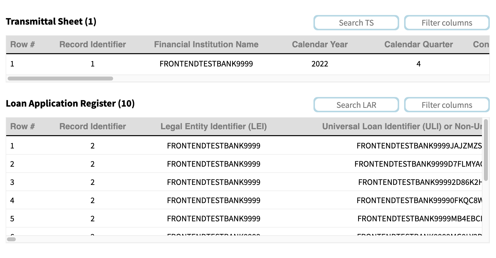
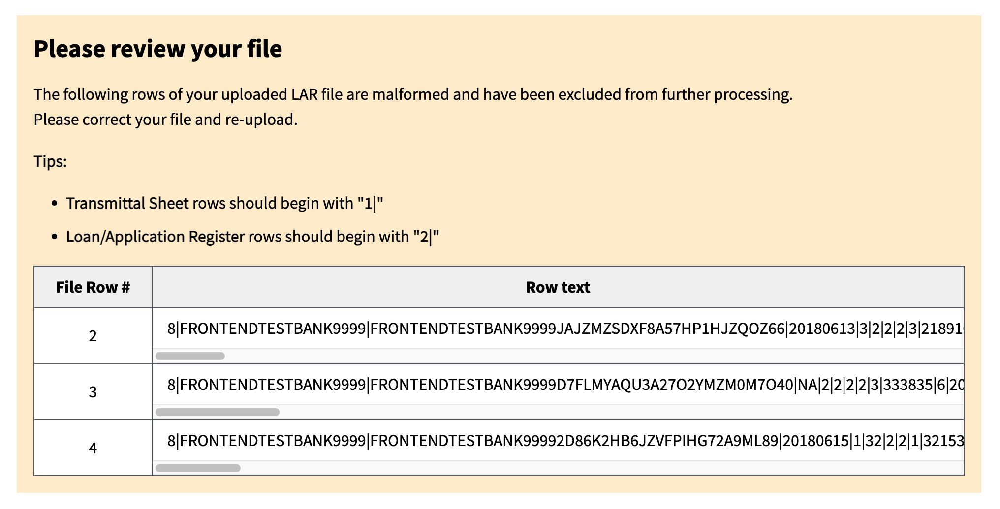
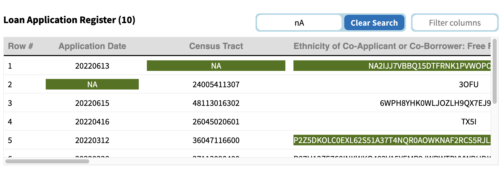
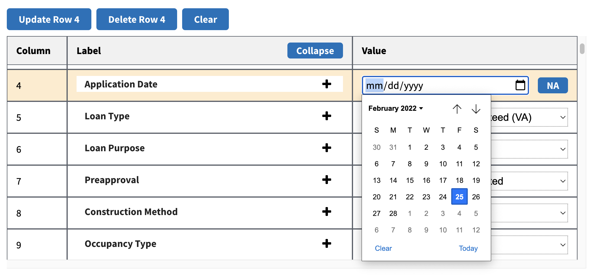
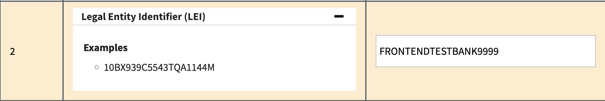
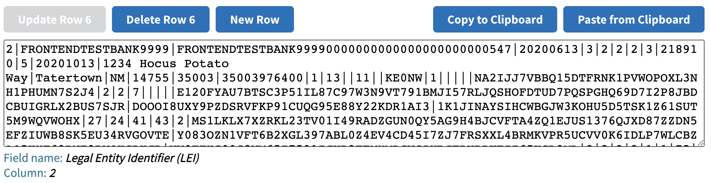

# HMDA LAR Formatting Tool - Instructions

## Table of Contents
* [Creating a LAR file from scratch](#creating-a-lar-file-from-scratch)
* [Editing an existing LAR file](#editing-an-existing-lar-file)
* [Interaction Guide](#interaction-guide)
  + [File Actions](#file-actions)
  + [Row Actions](#row-actions)
  + [Saved Records](#saved-records)
    - [Please Review](#please-review)
    - [Search text/Filter fields](#search-text-filter-fields)
  + [Editing a Record](#editing-a-record)
    - [Editor status](#editor-status)
    - [Parsed Values](#parsed-values)
    - [Pipe-Delimited Values](#pipe-delimited-values)
* [Frequently Asked Questions](#frequently-asked-questions)
* [HMDA Help](#hmda-help)

## Creating a LAR file from scratch
 
- Creating a Transmittal Sheet (TS) row
  - Click the [`Clear`](#row-actions) button to remove any previously entered data
  - Ensure the `Record Identifier` is set to `2 - LAR`
  - In the [`Editor status`](#editor-status) you will see `Creating Transmittal Sheet` if this is a new TS, `Updating Transmittal Sheet` if editing.
  - The `Record Identifier` is already set for you
  - Fill out your Insitution's information
  - Click [`Save Row`](#row-actions)
  - You will see your TS in the [`Saved Records`](#saved-records) sections
  - There is only one TS per LAR file.  Creating a new TS will overwrite any existing TS.
  - Now you can begin creating `Loan/Application Register (LAR)` rows.
- Creating a Loan/Application Register (LAR) row
  - Click the [`Clear`](#row-actions) button to remove any previously entered data.
  - Ensure the `Record Identifier` is set to `2 - LAR`
  - Use the [`Parsed Values`](#parsed-values) view for easier data input.
  - Use the [`Pipe-Delimited Values`](#pipe-delimited-values) for quick row navigation and data scanning.
  - Click [`Save Row`](#row-actions) to store this Loan/Application's data.
  - Saved rows are listed in the [`Saved Records`](#saved-records) section. 
- Editing data
  - Selecting a record in [`Saved Records`](#saved-records) will populate that row's data in the [`Editing`](#editing-a-record) section of the app.
    - [`Parsed Values`](#parsed-values) provides examples of field inputs, field and input descriptions, and easy selectors for enumerated fields.
    - [`Pipe-Delimited Values`](#pipe-delimited-values) provides the row's raw text, as it will appear in your downloaded LAR file.
      - Clicking in a field will highlight that value in the [`Parsed Values`](#parsed-values) section for quick editing.
  - Use the [`Editing`](#editing-a-record) section to make your required modifications.
  - Click the [`Update Row...`](#row-actions) button to persist your changes.
- Deleting a row
  - Selecting a record in [`Saved Records`](#saved-records) will populate that row's data in the [`Editing`](#editing-a-record) section of the app.
  - Click the [`Delete`](#row-actions) button to remove the selected row.
- Downloading the LAR file
  - Use the [`Download File`](#file-actions) button to download a pipe-delimited, UTF-8 encoded, `.txt` file containing the TS and LAR data shown in the [`Saved Records`](#saved-records) section.  Unsaved data entered in the [`Editing`](#editing-a-record) section is not included in the downloaded LAR file. 
  - The file is saved to your browser's default download directory as `LarFile.txt` or `LarFile(#).txt`.
  - The data is now formatted into a pipe-delimited text file (as shown below) and ready to be submitted to the HMDA Platform. Prior to submission, the file format can be verified by the **File Format Verification Tool**.  

  
## Editing an existing LAR file
 
- Use the [`Upload File`](#file-actions) button to select your file.  All processing is done in your browser, no data is sent to the CFPB. 
  - Rows without a valid `Record Identifier` are filtered out during data parsing and in a [`Records for review`](#please-review) section.  You should review these records and update them if appropriate. 
- Use the [`Saved Records`](#saved-records) area to find records relevant to your focus.  
  - You can search the text of your file using the `Search TS/LAR` boxes.  
  - You can filter which fields are shown using the `Filter columns/Filter by label` boxes.
- Selecting a record in [`Saved Records`](#saved-records) will populate that row's data in the [`Editing`](#editing-a-record) section of the app
  - [`Parsed Values`](#parsed-values) provides examples of field inputs, field and input descriptions, and easy selectors for enumerated fields.
  - [`Pipe-Delimited Values`](#pipe-delimited-values) provides the row's raw text, as it will appear in your downloaded LAR file.
    - Clicking in a field will highlight that value in the [`Parsed Values`](#parsed-values) section for quick editing.
- After making your changes, use the [`Download File`](#file-actions) button to create and download your LAR file.
- The data is now formatted into a pipe-delimited text file (as shown below) and ready to be submitted to the HMDA Platform. Prior to submission, the file format can be verified by the **File Format Verification Tool**.  

  
## Interaction Guide

### File Actions

- **Upload**: Work with an existing pipe-delimited LAR file.
- **Download**: Create a LAR file based on the currently saved LAR data.
- **Clear Saved**: Start fresh by erasing all LAR data.

### Row Actions

- **Save/Update**: Create/Modify the currently selected row.
- **Delete**: Remove the selected row from [`Saved Records`](#saved-records)

### Saved Records
Search your existing records' text or filter to view a single LAR field, helping to focus your LAR data reviews.

- **Transmittal Sheet**: Institution information
- **Loan/Application Records**: Application records
#### Please Review
 
If there are records in an uploaded LAR file that we could reliably parse, you will see the following.

#### Search text/Filter fields

  - Use the `Search` box to find rows that contain the entered text. 
  - Use the `Filter` box to restrict which LAR fields are displayed.

### Editing a Record
#### Editor status
The header of the row editor will remind you whether you are Creating or Updating the current Editor row.
  

#### Parsed Values
Edit the selected row with guided enumerations, examples, and field decriptions. Changes are not persisted until you click [`Update/Save`](#row-actions).

  - Enumerations
  - Dates + NA
  - Free-text + NA/Exempt
  - Field details
  

#### Pipe-Delimited Values
Edit the selected row as if you were directly in the LAR file. Changes are not persisted until you click [`Update/Save`](#row-actions).

  - **Clipboard Copy/Paste**: Easily import/export date between applications.
  - **Linking with Parsed Values**: Selecting a field in the textarea will highlight the same field in [`Parsed Values`](#parsed-values) to make editing data easier with the guided enumerations, examples, and field decriptions.

## Frequently Asked Questions
The Frequently Asked Questions are available at https://ffiec.cfpb.gov/documentation/2021/faqs/

## HMDA Help
Technical questions about reporting HMDA data collected in or after 2017 should be directed to hmdahelp@cfpb.gov.