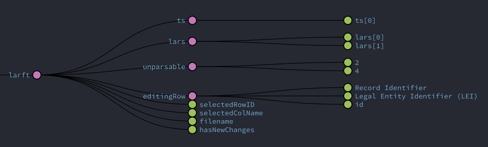
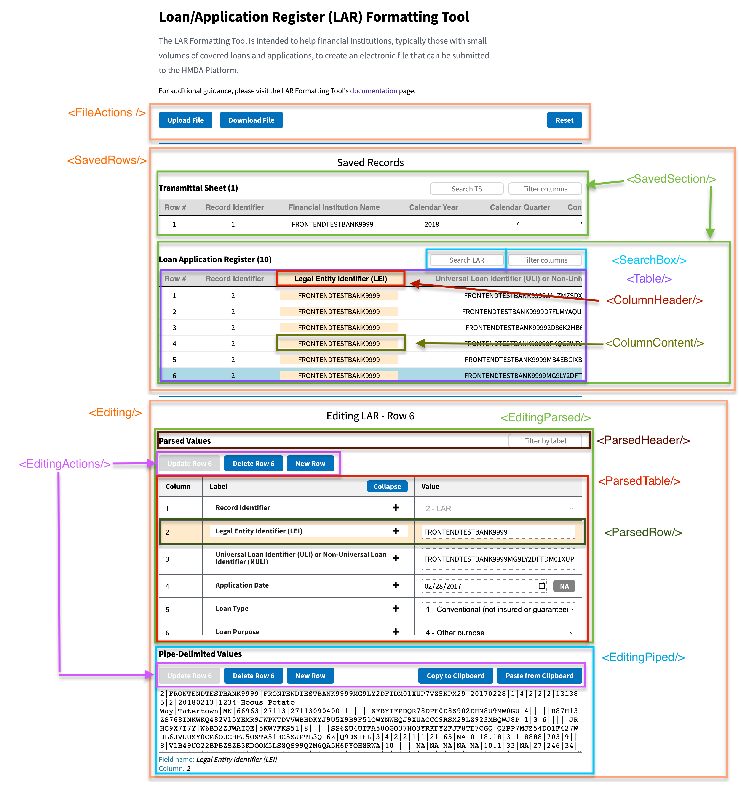

# LARFT Dev Docs

- [LARFT Dev Docs](#larft-dev-docs)
- [OLARFT Data Flow](#olarft-data-flow)
  - [Storage](#storage)
  - [UI Interactions](#ui-interactions)
    - [File Upload](#file-upload)
    - [Click `Download File`](#click-download-file)
    - [Click `Reset`](#click-reset)
    - [Click on a Saved Row](#click-on-a-saved-row)
    - [Click `Save Row`/`Update Row`](#click-save-rowupdate-row)
    - [Click `Delete Row`](#click-delete-row)
    - [Click `New Row`](#click-new-row)
    - [Click on a column (either in Saved Rows table or in Editing section)](#click-on-a-column-either-in-saved-rows-table-or-in-editing-section)
- [OLARFT Component Overview](#olarft-component-overview)

# OLARFT Data Flow

Most app state is stored in Redux. We use `selectors` to access stored data and try to do so as close to where the data is used as possible. That said, there are instances where selected data is passed down the component tree from a connected component, usually after being integrated into an event handler, to reduce code duplication.

Search and filter logic is handled at the component level via `useState`.

## Storage

There is a `larft` slice that tracks the following items (screenshot from Redux DevTools):

| State           | Type    | Description                                                                             | Example                                                 |
| --------------- | ------- | --------------------------------------------------------------------------------------- | ------------------------------------------------------- |
| ts              | Array   | Saved Transmittal Sheet rows                                                            |                                                         |
| lars            | Array   | Saved Loan/Application Register rows                                                    |                                                         |
| unparsable      | Object  | Row strings (tracked by line #) from an uploaded file that could not be parsed          | In the above graphic, lines 2 and 4 could not be parsed |
| editingRow      | Object  | The currently selected or 'In Progress' row                                             |                                                         |
| selectedRowId   | String  | Row identifier of the `editingRow`                                                      | "5"                                                     |
| selectedColName | String  | Label of the currently focused column                                                   | "Legal Entity Identifier (LEI)"                         |
| filename        | String  | Derived filename used when user downloads their data                                    | "2018-4-FRONTENDTESTBANK9999"                           |
| hasNewChanges   | Boolean | Have any saved rows changed since the last time the `Download File` button was clicked? |                                                         |

## UI Interactions

A brief overview of how user actions affect the app state.

### File Upload

- File read line-by-line
  - If line is malformed => `larft.unparsable[row#] = <row string from file>`
  - If line is ts => `larft.ts[0] = <parsed row object>`
  - If line is lar => `larft.ts.push(<parsed row object>)`
- If the TS has year + quarter + LEI data
  - `larft.filename = "YEAR-QUARTER-LEI.txt"`

### Click `Download File`

- `larft.hasNewChanges = false`

### Click `Reset`

- All Redux state reset to initial values

### Click on a Saved Row

- `larft.editingRow = <parsed row object>`

### Click `Save Row`/`Update Row`

- If row is TS => `larft.ts[0] = editingRow`
- If row is LAR => `larft.lar[editingRow.id] = editingRow`
- `larft.hasNewChanges = true`

### Click `Delete Row`

- Entry removed from `larft.ts` or `larft.lar` based on `row.id`
- `larft.hasNewChanges = true`

### Click `New Row`

- `larft.editingRow = <new row object>`
- `larft.selectedColName = null`

### Click on a column (either in Saved Rows table or in Editing section)

- If in Saved Rows
  - `larft.selectedRowId = <clicked row.id>`
  - `larft.editingRow = <clicked row object>`
  - `larft.selectedColName = <clicked column>`
- If in Editing section
  - `larft.selectedColName = <clicked column>`

# OLARFT Component Overview

A quick ref to help identify where you might want to start when debugging, updating, or refactoring.

